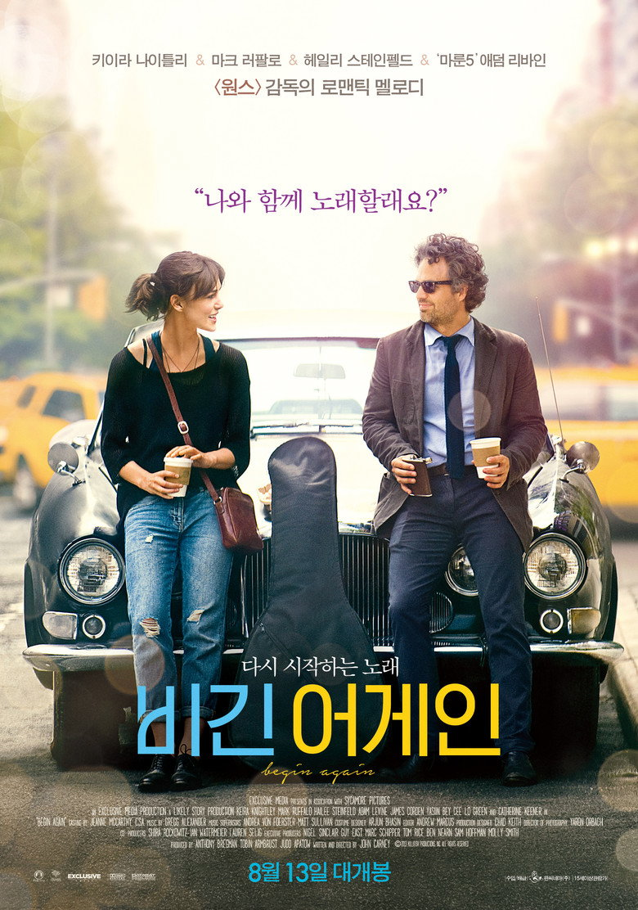
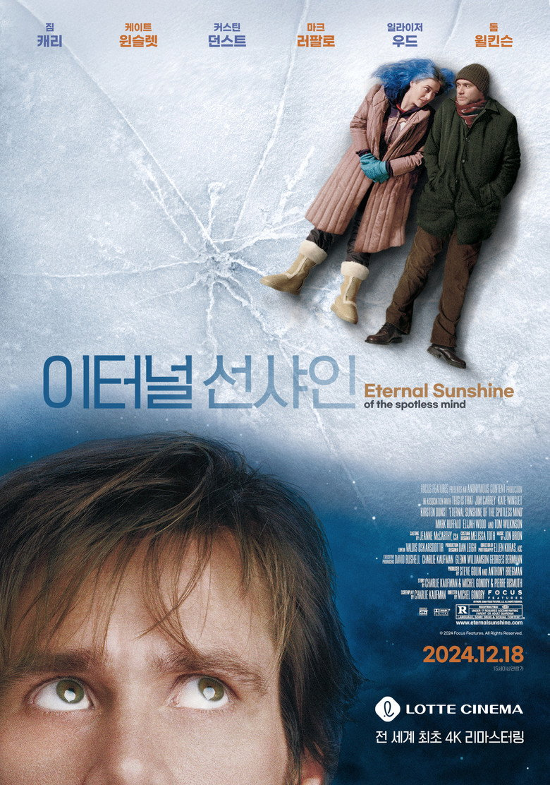
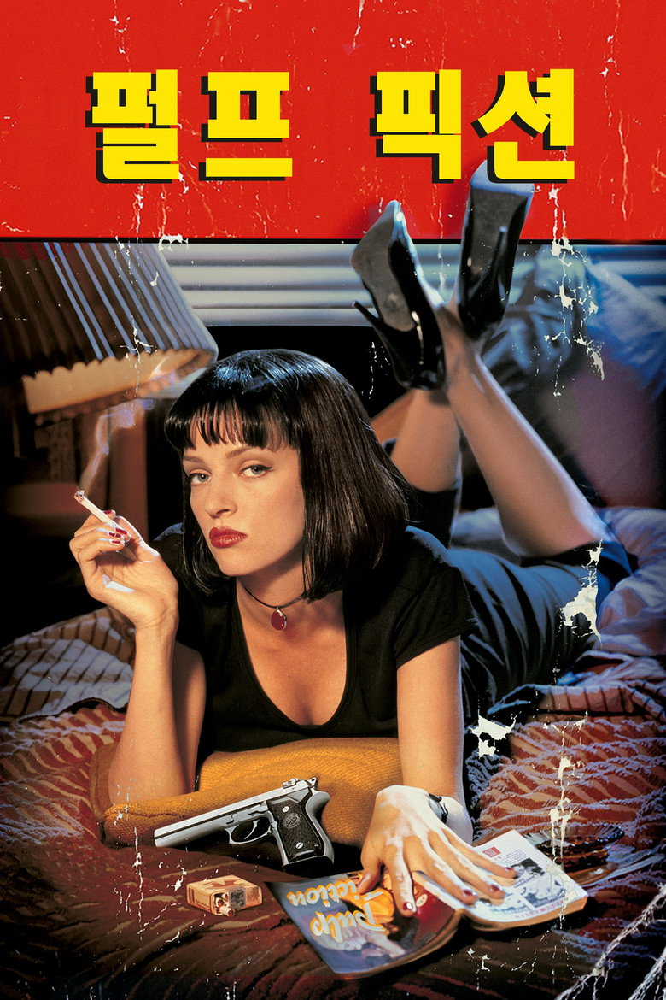
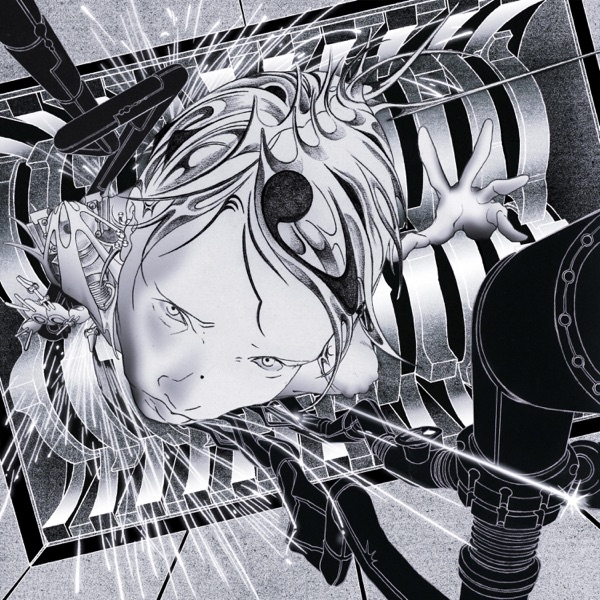
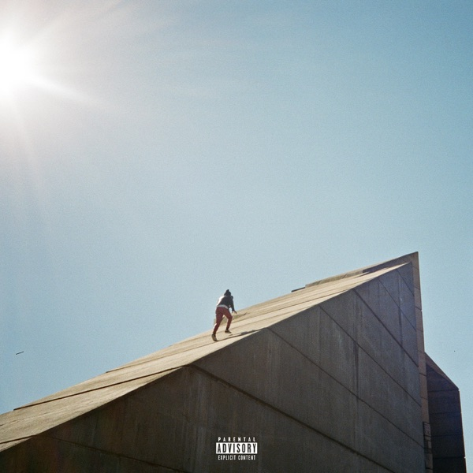
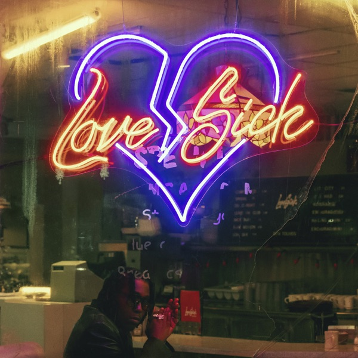
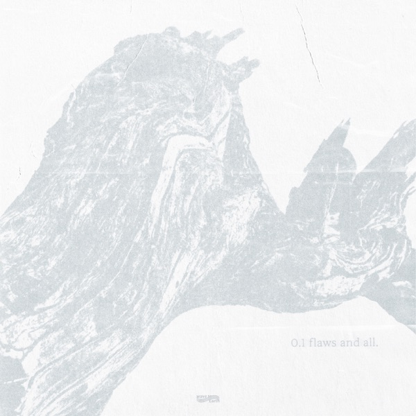
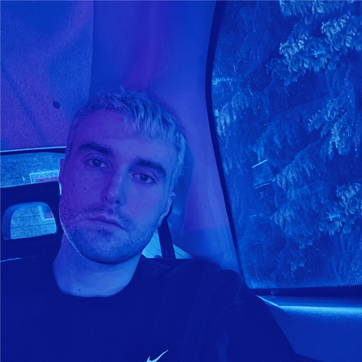
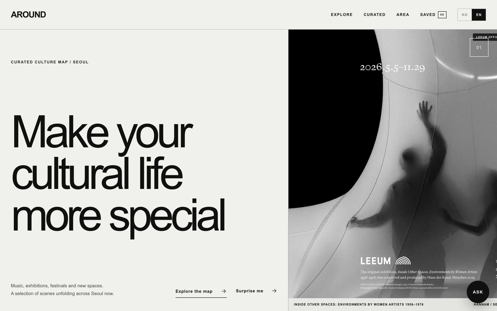

&nbsp;

 

# Sungjeh Yoon

Hey, I'm Sungjeh! But I also go by Jayden. I'm currently a junior at the SSAI department at Hankuk
University of Foreign Studies (HUFS), and I do research as an undergraduate at
SensCore-Lab. Outside academics, you could find me out on a run, watching
a movie, or digging new music. I also lived couple years out in Chi town.

---

### 🎞️ Lifetime top 3 films

<table>
  <tr>
    <td align="center"></td>
    <td align="center"></td>
    <td align="center"></td>
  </tr>
  <tr>
    <td align="center"><b>Begin Again</b></td>
    <td align="center"><b>Eternal Sunshine of the Spotless Mind</b></td>
    <td align="center"><b>Pulp Fiction</b></td>
  </tr>
</table>

### 🎧 On repeat

<table>
  <tr>
    <td align="center"></td>
    <td align="center"></td>
    <td align="center"></td>
    <td align="center"></td>
    <td align="center"></td>
  </tr>
  <tr>
    <td align="center"><b>Silica Gel</b> POWER ANDRE 99</td>
    <td align="center"><b>Daniel Caesar</b> Freudian</td>
    <td align="center"><b>Don Toliver</b> Love Sick</td>
    <td align="center"><b>wave to earth</b> 0.1 flaws and all.</td>
    <td align="center"><b>Fred again..</b> Actual Life 3</td>
  </tr>
</table>

---

### 🛠️ Stack

  
  
  
  
  
  
  

  
  
  
  
  
  
  

---

### 🗺️ Featured — AROUND · Seoul Culture Map

*Discover Seoul's music, exhibitions, festivals and cultural spaces through an*
*interactive map and an AI curator. A responsive web prototype.*

🗺️ **Map** — Leaflet + OpenStreetMap event map across Seoul 
🔎 **Filters** — by date, price, and category 
🤖 **AI curator** — Groq-powered, recommends only source-verified events 
🖼️ **Details** — editorial write-ups, official imagery, venue & visit info 
⭐ **Saves** — localStorage-based favorites

**Built with** React · TypeScript · Vite · Leaflet · Groq · Vercel

**[↗ Live demo](https://around-culture-map-brpc.vercel.app/)** &nbsp;·&nbsp; [Repo](https://github.com/muju0629/around-culture-map)

### 📂 Other work

🧬 **[UV-27 Virus Simulation](https://github.com/muju0629)** — Python OOP simulation engine with a React + TS visualization panel 
🎵 **[Unheard](https://github.com/muju0629/unheard)** — a music recommender that surfaces songs you probably haven't heard yet, built from your Apple Music export (Python · TF-IDF · Streamlit)

